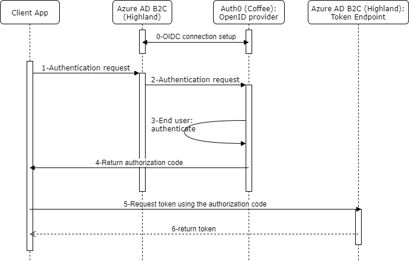
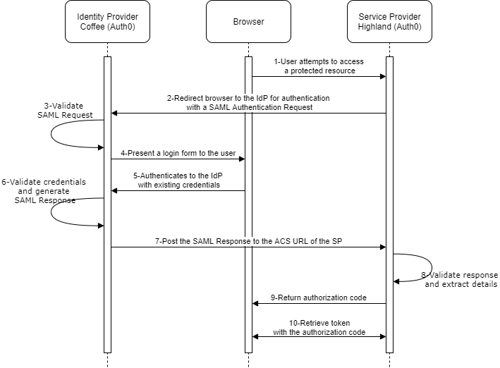

# Usage
### Backend
dotnet run

### Frontend
cd ClientApp

npm install

npm start

### Sample users
admin@coffee.com

user@coffee.com

pass: Rosen2019!

# Architecture
### Diagrams

#### OIDC Flow

#### SAML Flow

<!--*Source: https://www.elastic.co/blog/how-to-enable-saml-authentication-in-kibana-and-elasticsearch*-->

### Scenario
We have 4 applications, each one has its own service (including backend and frontend), and an identity provider (IDP).

The BE of one app can understand tokens issued by its IDP only. For example, Starbucks's BE can only understand tokens issued by Starbucks's IDP.

Question: how can we login into Starbucks, Highland and Highland B2C using Coffee's user credentials?

### Implementation
The BE and FE of all 4 apps is left untouched. For easier explanation, from now on we will call Coffee Identity Provider (IDP) and the 3 other apps Service Provider (SP). More details as follow:
- Coffee is Identity Provider using Auth0
- Starbucks and Highland are Service Provider using Auth0
- Highland B2C is Service Provider using Azure AD B2C

Setup communication between IDP and SP:
- Auth0 as IDP and Auth0 as SP: we setup SAML connection
- Auth0 as IDP and Azure AD B2C as SP: we setup Open ID Connect connection

Result: When user login into a SP using IDP's user credentials, the IDP will generate a token whose issuer is from the SP.

# References
- https://auth0.com/docs/protocols/saml/samlsso-auth0-to-auth0#8-create-the-html-page-for-a-test-application
- https://hackernoon.com/federated-identities-a-developers-primer-655a160d66cb
- https://www.youtube.com/watch?v=6H3iOIWaSzM
